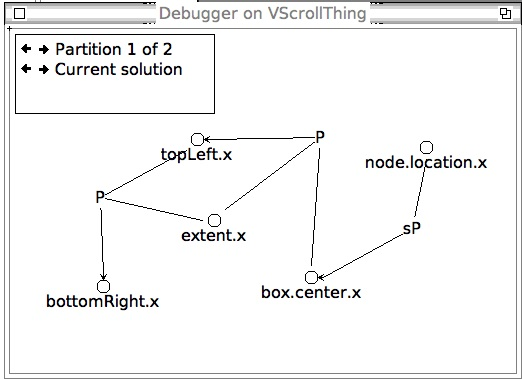

Original readme:

```
The second release of ThingLab II consists of the following files:

	README			-- this file
	ThingLabII.v2.st	-- Smalltalk code for the basic system
	Things.v2.st		-- Smalltalk code for the Primitive Things
	Demos.v2.st		-- Smalltalk code for a set of Demos (optional)
	ThingLabII.form		-- startup picture (optional)
	ThingManual.text	-- the manual, in plain text form
	ThingManual.word3.02	-- the manual, in Word 3.02 form

Please see the manual for installation directions. You'll need ParcPlace
Smalltalk-80 version 2.3 for the system to run correctly.  (There are no
plans to port it to a more recent version of Smalltalk.)

When FTP-ing these files, use ASCII mode for all files except ThingLabII.form
and ThingManual.word3.02, which should be transfered in BINARY mode.

========================================

In addition to the files listed above, the file SIGGRAPH_Demo.tar.Z is a
compressed tar file containing a ThingLab II demo prepared for a SIGGRAPH
tutorial by Bjorn Freeman-Benson.  It runs on the Macintosh under System 6.x.
SIGGRAPH-Demo.st.Z is the corresponding source file (which runs only under
ParcPlace release 2.3).

```

# This fork





Instructions: open `snapshots/ThingLab2.image` (WIP)

```smalltalk
IntroPicture openOn: (Form fromBinaryStream: (FileStream fileNamed: 'ThingLabII.form'))
```


## Manual instructions to make image
I'm a recent (zealous) convert to Squeak after visiting HPI, so I'm not too knowledgable yet. I've been following [Lawson English's youtube tutorials](https://www.youtube.com/watch?v=Es7RyllOS-M&list=PL6601A198DF14788D) and the [Squeak By Example 6.0](https://squeak.org/#documentation) ebook.

- Squeak 6.0
- Manually apply the patches in `1.parser-newer.st` (sorry)
- Projects > Create MVC Project
- Click on it to enter it
- Left click world menu > Open > File list
- Navigate to 2.ST80-prereqs.st
- Right click > fileIn entire file
- Navigate to 3.ThingLabII.v2.st, fileIn
- Currently fixing the errors as they come and committing back to 3.ThingLabII.v2.st
- Now you can fileIn 4.Things.v2.st, proceed past constraint errors
- Now you can `PartsBinView openOn: PartsBin topBin.`
- Currently fixing UI related errors from playing around

Errors so far:

- Code tries to use variable shadowing, but this is (now?) a syntax error. I've removed the local declaration, or renamed the block argument, or added a local declaration inside the block.
- Some method-constructing stuff tries to assign to a block argument: `vars _ nil`, but this is (now?) unassignable. Purpose seems to have been to allow things to get garbage collected. I've removed these statements, hope it doesn't pose a problem.
- Encoder class used to understand `init:context:notifying:` but some API change got rid of `context:`. Code was always passing `nil` anyway so I just removed the param.
- Equations use the Smalltalk compiler classes to obtain a syntax tree. Encoder expects `init: aCue` where `aCue` is a `CompilationCue` holding context for compiling Smalltalk code. ThingLab code calls `init: Object notifying: self`, i.e. just passes class `Object` as the cue ... which doesNotUnderstand the various `CompilationCue` methods. I'm guessing they just wanted a dummy cue, so now I create one, with a dummy environment to handle "undeclared" messages. Similarly, `Thing>>compileAccessMethodsFor:named:` seems to need a concrete `EncoderForSistaV1`.
- Squeak Blocks now send a supportsFullBlocks message, this has been added to EquationEncoder.
- ThingLab defines its own `CustomMenu` class, or perhaps tries to redefine/extend one in its 1989 environment. Squeak already has a `CustomMenu` class with more / different stuff, which clashes and causes critical menu failures which prevents debugging. Renamed this to `ThingLabCustomMenu`.
- ThingLab defines its own `drawFrom:to:`/`privateDrawFrom:to:` in `BitBlt`, which seems to work OK in an MVC project but utterly breaks the parent Morphic project. Renamed to `thingLabDrawFrom`, etc.
- Parse tree stuff in ThingLab tests for `isMemberOf: VariableNode`, but debugging reveals that all the intended instances seem to be `LiteralVariableNode`, a subclass presumably added in Squeak. Call sites now use `isKindOf` instead.
- Random API changes: ThingLab wants methods `black:` and `black` on `DisplayMedium`, which have been polyfilled. Similarly, code calls `unitVector` on `Point` which has also been polyfilled.
- Many differences in Form/Font/graphics etc methods between 1989 and 2024. Fonts/styles now need copying before modification. In the old days of the monochrome display, there was no need for a `Color` class, or even anything called "color", so drawing methods took a `mask:` param and methods `black`, `white`, `gray`, etc. lived in `Form`. Seems to be a reliable rule that `mask:` -> `fillColor:` and `Form <colorName>` -> `Color <colorName>`.
- Squeak lacks ST80 MVC classes like `SwitchView`, `IconView` etc. as can be attested in old manuals in google search results ([ref1](http://stephane.ducasse.free.fr/FreeBooks/InsideST/InsideSmalltalkII.pdf), [ref2](https://www.lri.fr/~mbl/ENS/FONDIHM/2013/papers/Krasner-JOOP88.pdf)). Thanks to [Rochus Keller's work](https://github.com/rochus-keller/Smalltalk), I obtained the `Smalltalk-80.sources` and ported SwitchView/Controller to colour-screen MVC (ST80-extras.st). Same with `CodeView` which ThingLab uses for the "explain" feature (literally to just show the expanation text...)
- ThingLab refers to a `Cursor hand` but it's not present even in the ST80 sources. Using `Cursor webLink` instead. API change `Sensor mousePoint` -> `Sensor cursorPoint`, fingers crossed this means the same thing. `Cursor bull` is now `Cursor crossHair`.
- ThingLab's `QuickPrint` subclasses `CharacterScanner`, which used to subclass `BitBlt`, whose methods and vars `QuickPrint` relies on. These days, `CharacterScanner` subclasses `Object`, and there is a concrete `BitBltDisplayScanner` containing a `BitBlt`. `QuickPrint` now subclasses `BitBltDisplayScanner` and delegates to its `bitBlt` where necessary.
- `ThingLabCustomMenu` subclasses `ActionMenu`, not present in Squeak - so it ends up subclassing `ProtoObject` (???), which doesn't understand inspector protocols and sends you into a bottomless pit of debugging windows. Ported `ActionMenu` from ST80 sources.
- `Point` and `Rectangle` seem to have been made immutable, where the same methods called by ThingLab now return a new object instead of mutating the old one. This is a straightforward fix, except for the one place ThingLab relies on this behaviour (computing forces in the constraint debugger force layout; I've polyfilled the mutation methods).
- ThingLab creates many 16x16 monochrome icons using `Form extent:fromArray:offset`, providing an array of 16-bit integers for the pixel rows. However, all we get is a blank square. `Form` seems to have a minimum size of 32x32, at least for 1-bit depth, so we intercept these constructions and shift the array left by 16 to get the graphics in the left half of the 32x32 grid. (This was already done in the class method in `Cursor`, because 16x16 mono cursors are still standard.) This is probably because Bitmaps are now chunked into 32-bit words instead of 16-bit from the old days.
- When it wants to rearrange formulas, the individual `VariableNodes` accessed via `receiver key` are now Associations `varName -> nil` instead of just the `varName`, so `receiver key` is now `receiver key key`...

Abandoned error: the very last line of the original ThingLabII.v2.st calls `initializeYellowButtonMenu` on all instances of ScreenController, but one or more doesNotUnderstand.

After fileIn the Things library into the workspace:

```smalltalk
(FileStream fileNamed: 'Things.v2.st') fileIn
```

Current errors are first "failed to resolve constraints" (ignore) and then related to graphics API changes when clicking on UI elements. Constraint errors:

- `SimpleRectThing>>initializeValues` on `self set: #extent.x to: 40`
- `OrbitThing>>initializeConstraints` on:

```smalltalk
self require: 'newTheta = ((oldTheta + delta) \\ 360)'
		where: #((newTheta theta.value)
				 (oldTheta theta.last)
				 (delta rate.node.value)).
```

- `OrbitThing>>initializeValues` on `self set: #rate.node.value to: 18`

NB: Fixing these errors has been a *delight* compared to every other programming system I've ever used, because it's a live homogenous system, I can edit the code in the debugger and restart from that stack frame, inspect/browse anything and it was all pretty intuitive for me to figure out ... hence why I have the zeal of a new convert. The future has been here for 44 years, obscured by history, bad business decisions and Worse Is Better...